# USA Landmarks Quiz

The main goal of the USA Landmarks Quiz is to provide an engaging and educational experience for users by testing their knowledge of famous landmarks in the United States. The quiz aims to be interactive, visually appealing, and accessible to a wide audience.

Please find a link to the deployed site [here](https://rdawson96.github.io/usa-landmark-quiz/)

## Table of Contents
  - [User Experience](#user-experience)
    - [Project Goals](#project-goals)
    - [User Stories](#user-stories)
    - [Colours Used](#colours-used)
    - [Fonts used](#fonts-used)
    - [Wireframes](#wireframes)
  - [Features](#features)
    - [General Features](#general-features)
  - [Frameworks and Programs Used](#frameworks-and-programs-used)
    - [Languages used](#languages-used)
  - [Testing](#testing)
    - [Validator Testing](#validator-testing)
      - [Validation Errors](#validation-errors)
    - [Accessibility](#accessibility)
      - [1. Lighthouse testing](#1-lighthouse-testing)
      - [2. Semantic HTML](#2-semantic-html)
      - [3. ARIA (Accessible Rich Internet Applications)](#3-aria-accessible-rich-internet-applications)
      - [4. Contrast and Readability](#4-contrast-and-readability)
      - [5. Alt Text for Images](#5-alt-text-for-images)
      - [6. Responsive Design](#6-responsive-design)
    - [Manual testing](#manual-testing)
      - [Browser Compatibility](#browser-compatibility)
  - [Bugs](#bugs)
  - [Finished Product](#finished-product)
  - [Deployment](#deployment)
    - [Github](#github)
  - [Credits](#credits)
    - [Content](#content)
    - [Media](#media)
    - [Code](#code)

## User Experience

### Project Goals
- Provide an engaging and educational experience for users
- Test users' knowledge of famous landmarks in the United States
- Create an interactive and visually appealing quiz
- Ensure accessibility to a wide audience

### User Stories
- As a user, I want to test my knowledge of USA landmarks.
- As a user, I want the quiz to be easy to navigate and understand.
- As a user, I want feedback on my answers.
- As a user, I want the quiz to be visually appealing with high-quality images.

### Colours Used
The color scheme of the USA Landmarks Quiz is inspired by the colors of the American flag:

### Fonts used
The primary font used in the quiz is Nunito, sourced from Google Fonts.

### Wireframes
Balsamiq has been used to show the appearance of the site on different devices

|Page | Desktop Version | Mobile Version |
| --- | --- | --- |
| Home page | 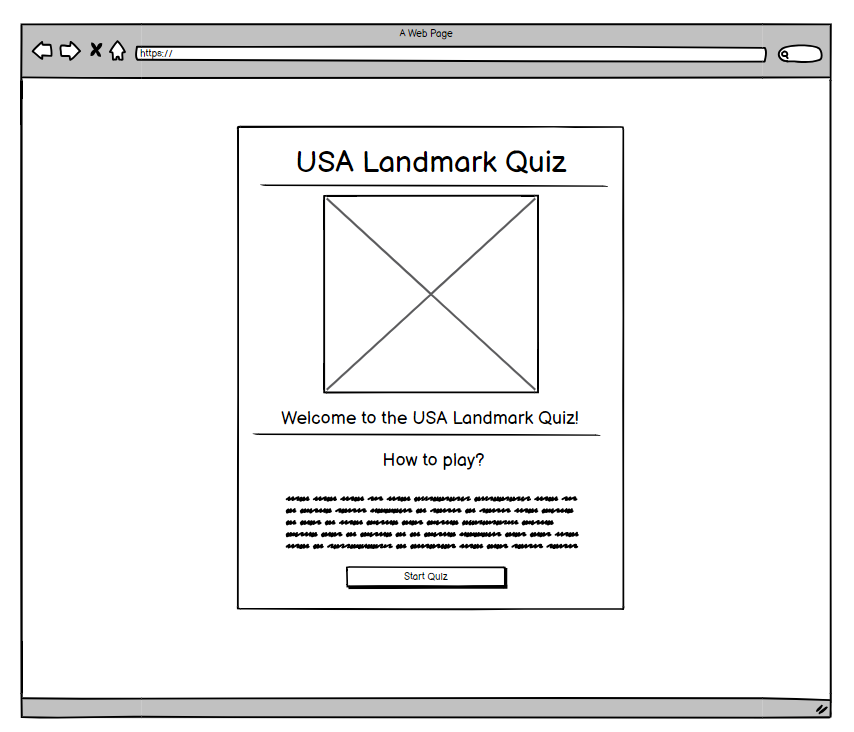 | 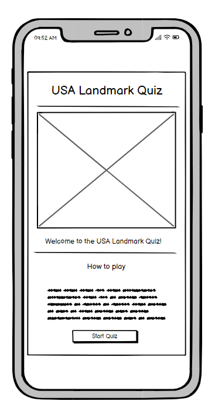 |
| Game page | 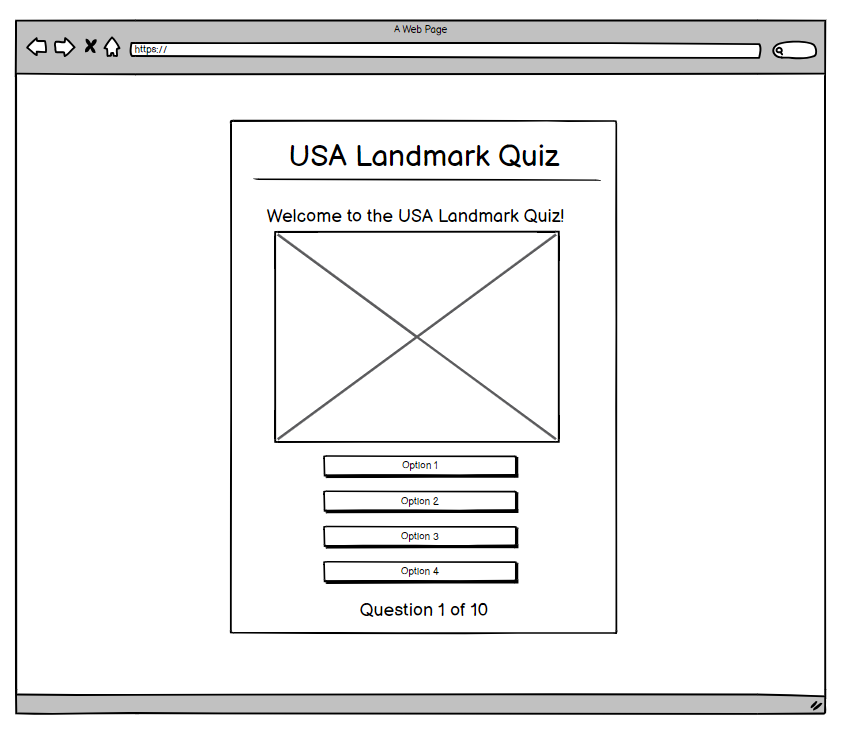 | 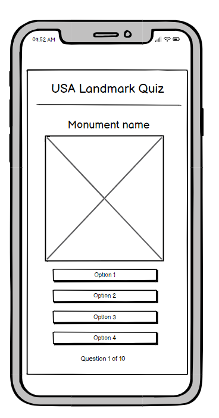 |
| Results page | 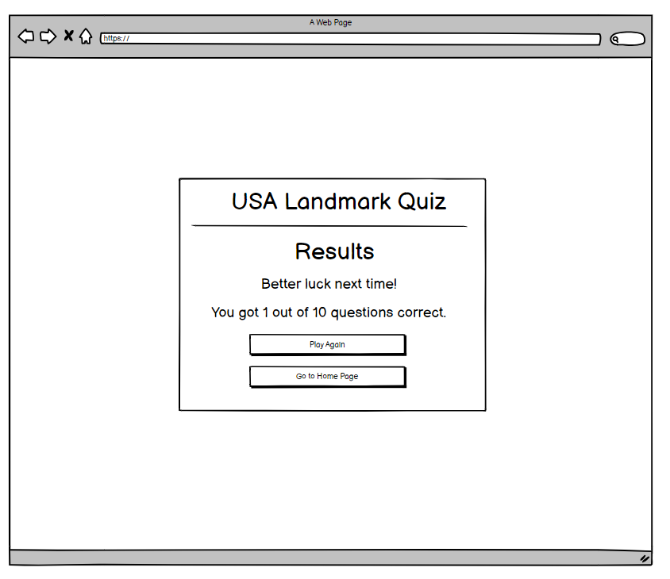 | 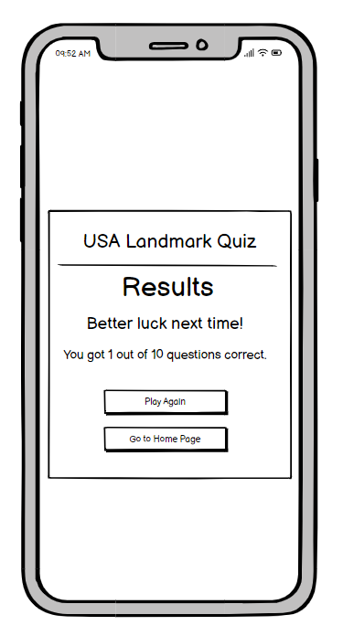 |

## Features

### Home Page:
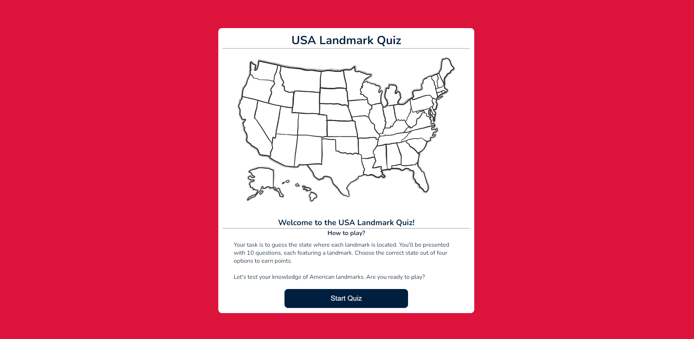
- **Introduction Section:**
  - Feature: Provides an introduction to the USA Landmarks Quiz, including a welcoming message and brief instructions on how to play.
  - Value Added: Sets the tone for the quiz and informs users about what to expect.

- **Start Quiz Button:**
  - Feature: Prominent button labelled "Start Quiz."
  - Value Added: Offers a clear call-to-action for users to begin the quiz, encouraging immediate engagement and interaction with the site's content.

### Game Page:
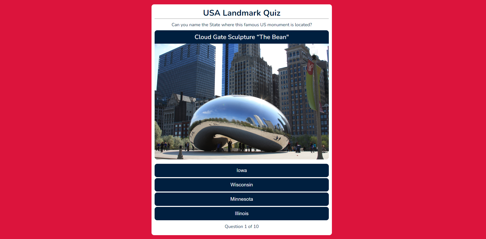
- **Quiz Question Display:**
  - Feature: Displays a question related to a USA landmark, along with multiple-choice options (A, B, C, D).
  - Value Added: Engages users with interactive quiz content, prompting them to recall knowledge of landmarks and select the correct answer.

- **Landmark Image Display:**
  - Feature: Accompanying image of the landmark associated with the current question.
  - Value Added: Provides visual context for the quiz question, aiding users in identifying the landmark and enhancing the overall quiz experience.

- **Option Buttons:**
  - Feature: Four option buttons (A, B, C, D) corresponding to the multiple-choice answers.
  - Value Added: Allows users to select their answer choice conveniently, facilitating quiz participation and interaction.

- **Question Number Counter:**
  - Feature: Question number at the bottom of page corresponding to the question that the user is on.
  - Value Added: Users can easily track their progress and anticipate the number of questions remaining.

### Results Page:
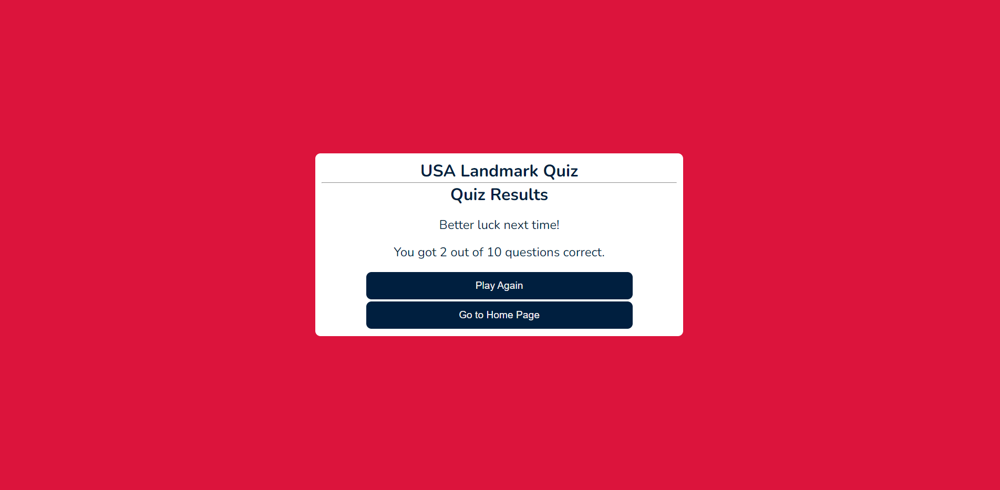
- **Quiz Results Display:**
  - Feature: Displays the user's quiz results, including their score and a message based on their performance (e.g., "Congratulations" for a high score or "Better luck next time" for a low score).
  - Value Added: Provides feedback to users on their quiz performance, motivating them to improve their knowledge and potentially replay the quiz.

- **Play Again Button:**
  - Feature: Button labelled "Play Again."
  - Value Added: Enables users to restart the quiz immediately, encouraging repeat engagement and allowing them to further test their knowledge of USA landmarks.

- **Go to Home Page Button:**
  - Feature: Button labelled "Go to Home Page."
  - Value Added: Enables users to got back to the Home Page, encouraging repeat engagement and allowing them to further test their knowledge of USA landmarks.

## Frameworks and Programs Used

- [Codeanywhere](https://app.codeanywhere.com/)
  - Codeanywhere was used for writing code, committing, and then pushing to GitHub. [GitHub](https://githubcom/)

- [Balsamiq](https://balsamiq.com/)
  - Balsamiq was used to create the wireframes during the design phase of the project.

- [Google Fonts](https://fonts.google.com/)
  - Google Fonts was used to import the font Nunito Italic into the style.css file. Theis font were used throughout the site.

- [Multi Device Website Mockup Generator](https://techsini.com/multi-mockup/index.php)
  - Responsive Design Checker was used in the testing process to check responsiveness on various devices and to generate mock-up image.

- [Chrome DevTools](https://developer.chrome.com/docs/devtools/)
  - Chrome DevTools was used during development process for code review and to test responsiveness.

- [Coolers Contrast Checker](https://coolors.co/contrast-checker/112a46-acc8e5)
  - Coolers Contrast Checker was used to make sure the colors I used contrasted well enough for all users.
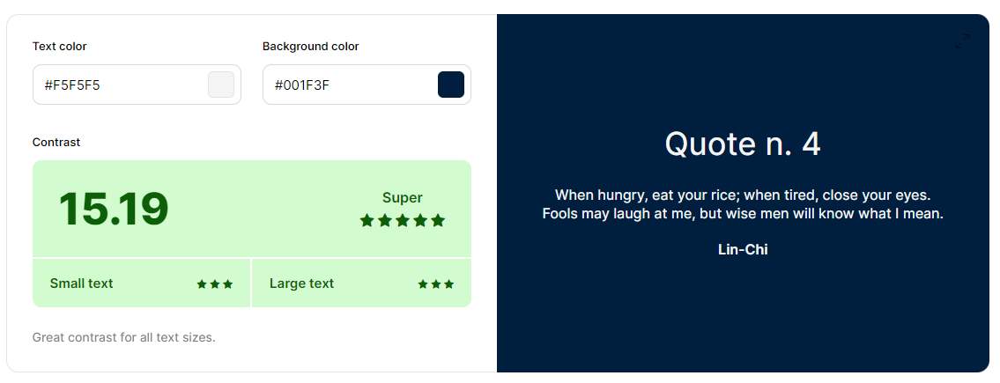
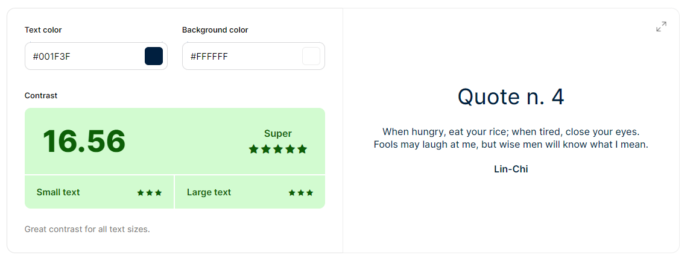

- [W3C Markup Validator](https://validator.w3.org/)
  - W3C Markup Validator was used to validate the sites HTML code.

- [W3C CSS Validator](https://jigsaw.w3.org/css-validator/)
  - W3C CSS Validator was used to validate the sites CSS code.

- [JSHint](https://jshint.com/)
  - JSHint was used to validate the sites Javascript code.

### Languages Used

* [HTML5](https://en.wikipedia.org/wiki/HTML5)
* [CSS3](https://en.wikipedia.org/wiki/CSS)
* [Javascript](https://en.wikipedia.org/wiki/JavaScript)

## Testing

### Validator Testing

- The [W3C Markup Validator](https://validator.w3.org/), [W3C CSS Validator](https://jigsaw.w3.org/css-validator/) and [JSHint](https://jshint.com/) services were used to validate all pages of the project in order to ensure there were no syntax errors.

#### Validation Errors
**HTML**
  - The validator found that I had missing quotation marks in my options buttons that threw up multiple errors. This was located and fixed. The validator now shows no errors.
  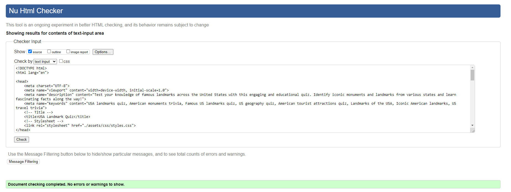
**CSS**
  - The validator found one error with my CSS where I had a stray semicolon. 
  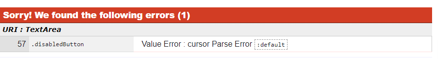
  This was located and deleted. The validator now shows no errors.
  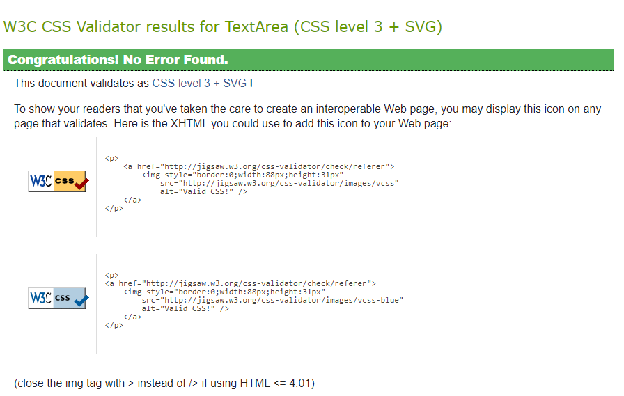
**Javascript**
  - The validator gave one warning. 
  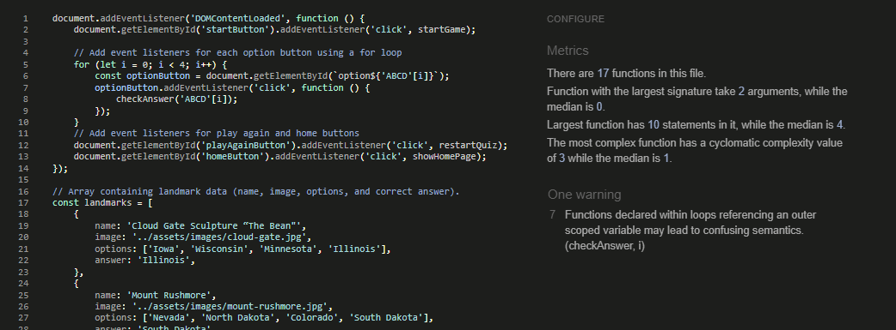
  - This was fixed by altering the event listeners to not reference outer scope variable by adding new function that serves as a new event.listener
  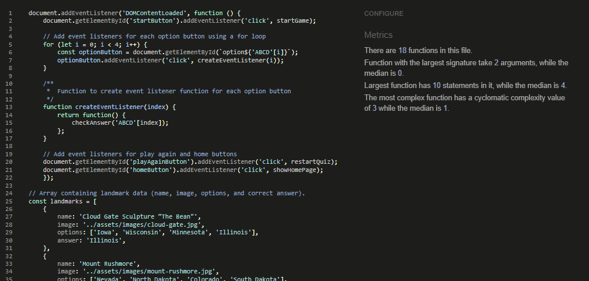

[back to the top](#usa-landmarks-quiz)

### Accessibility

#### 1. Lighthouse testing

Light house in Chrome Dev tools was used to confirm accessibility of the site and confirm that the colors of the site are easy to read.

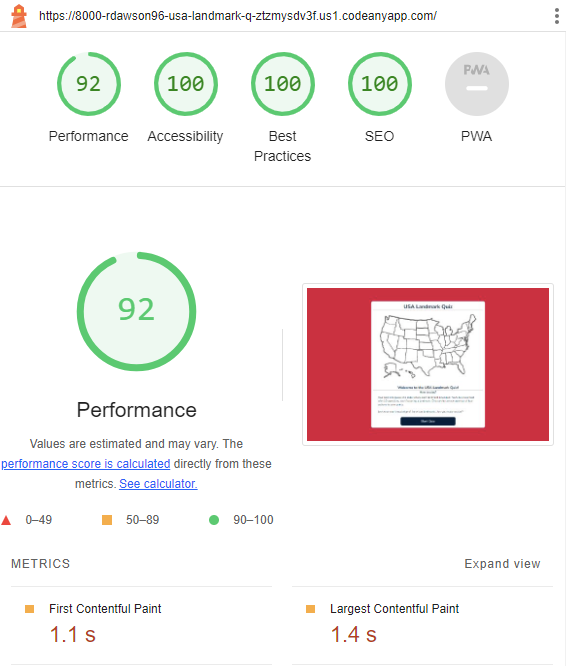

#### 2. Semantic HTML

Ensured all HTML elements had appropriate semantic meaning for accessibility.

#### 3. ARIA (Accessible Rich Internet Applications)

ARIA attributes were utilised on links to enhance the accessibility of the site allowing for screen readers to accurately pick up information.

#### 4. Contrast and Readability

[Coolers Contrast Checker](https://coolors.co/contrast-checker/112a46-acc8e5) was used to ensure  sufficient contrast in colors chosen to make the content readable for users with visual impairments.

#### 5. Alt Text for Images

All images on the website include descriptive alternative text (alt text). This helps users with visual impairments understand the content and context of images even if they cannot see them.

#### 6. Responsive Design

The website is responsive, providing a seamless experience across various devices and screen sizes. This benefits users with different abilities and ensures a consistent and accessible user experience.

This was tested via [Chrome DevTools](https://developer.chrome.com/docs/devtools/) as the project progressed.

### Manual testing

- Home page

| Feature | Test case | Outcome |
| --- | --- | --- |
| Hide other elements | Check whether the Quiz and results page are hidden when the page loads | PASS |
| Start quiz button | Check the Quiz page loads and Home and Results page are hidden when the button is clicked | PASS |
| Start quiz button hover  | Check the button changes color when the user hovers over the button | PASS |

- Game page

| Feature | Test case | Outcome |
| --- | --- | --- |
| Hide other elements | Check whether the Home and Results pages are hidden | PASS |
| Landmark title | Check that the correct Landmark title is loaded onto the page | PASS |
| Landmark image | Check that the correct landmark image is loaded onto the page | PASS |
| Options buttons | Check that the correct states are loaded into the four options buttons | PASS |
| Options buttons correct colour| Check that once a button is clicked, it turns green when the selected answer is correct | PASS |
| Options buttons incorrect colour| Check that once a button is clicked, it turns red when the selected answer is incorrect and the correct image turns green | PASS |
| Options buttons once button clicked| Check that the page removes the event listeners once an option is clicked so that the user isn't able to click multiple options | PASS |
| Options buttons disable hover and pointer | Check that once a button is clicked, no other buttons can be clicked until the next page is loaded | PASS |
| Question number | Check that the question number increments by one when the next question loads | PASS |

- Results page

| Feature | Test case | Outcome |
| --- | --- | --- |
| Hide other elements | Check whether the Home and Quiz pages are hidden | PASS |
| Result message | Check that the correct message appears depending on the users score | PASS |
| Result score | Check that the correct score displays on the page | PASS |
| Play again button | Check that the play again button takes the user to the first question | PASS |
| Go to Home page button | Check that the home button takes the user back to the home page | PASS |
| Buttons hover | check that the buttons change color when the mouse is hovered over them | PASS |

[back to the top](#usa-landmarks-quiz)

#### Browser Compatibility

The website has been tested on the following browsers:
- Google Chrome
  - No appearance, responsiveness nor functionality issues.
- Microsoft edge
  - No appearance, responsiveness nor functionality issues.
- Safari
  - No appearance, responsiveness nor functionality issues.

## Bugs

- Solved bugs
    - Event listeners not being disabled correctly so that user was able to click quickly through and skip questions 
      - Revised the code to ensure that event listeners are properly disabled when needed, especially during the checkAnswer function.
    - Next question not loading after a delay 
      - Adjusted the setTimeout function in the checkAnswer function to ensure that the next question loads after the specified delay.
    - Question number tallying up when the quiz was restarted 
      - Implemented a reset function to reset the question number to its initial value when the quiz is restarted, ensuring that it doesn't continue incrementing from where it left off.

[back to the top](#usa-landmarks-quiz)

## Finished Product

| Page | Desktop | Mobile |
| --- | --- | --- |
| Home page |  | 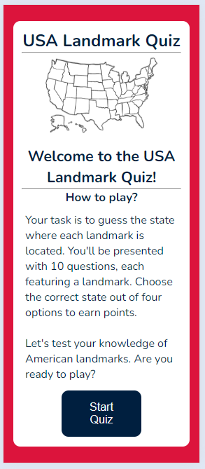 |
| Quiz page |  | 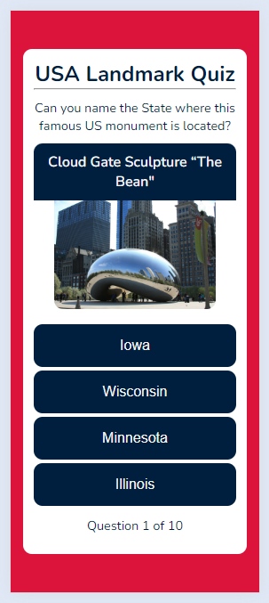 |
| Results page |  | 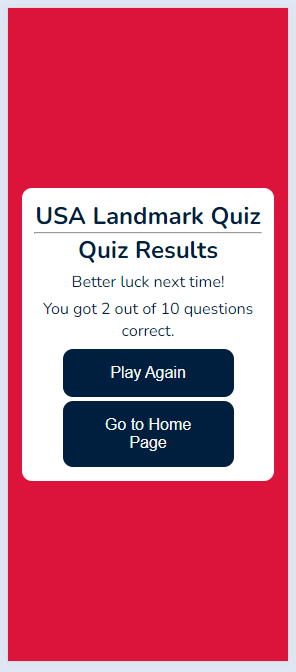 |

## Deployment

### Github

The following steps are to deploy the website to Github Pages from the GitHub repository:
1. Log in to GitHub and locate the [GitHub Repository](https://github.com/).
2.  At the top of the Repository, Go to the Settings button on the menu.
3. Scroll down the Settings page until you locate the Pages section.
4. Under Source, click the dropdown called None and select Master Branch.
5. The page will refresh automatically and generate a link to your website.

## Credits

### Media
All images featured on this site are sourced from royalty-free libraries.

- Quiz Images
  - [pxhere](https://pxhere.com/)
    - Mount Rushmore image by pxhere
    - Statue of Liberty image by pxhere
    - Cloud Gate image by pxhere
    - Grand Canyon image by pxhere
    - Crazy Horse image by pxhere
  - [pexels](https://www.pexels.com/)
    - Monument Valley image by Pixabay
    - The Space Needle image by Sergei A
    - Lincoln Memorial image by Pixabay
    - Golden Gate Bridge image by Pixabay
  - [unspalsh](https://unsplash.com/)
    - Hoover Dam image by Emily-Jo Sutcliffe
- Home Page image
  - [Freepik](https://www.freepik.com/)
    - Image of USA by rocketpixel

### Code

- I used [The Web Shala's](https://www.youtube.com/watch?v=J8QbjXdVl9c&ab_channel=TheWebShala) YouTube tutorial for inspiration for using hide classes and keeping all the html in one document.
- I used [Game Dev Academy](https://gamedevacademy.org/javascript-docstrings-tutorial/) tutorial on docstrings to help master the labelling of my javascript. Especially for the docstring of my CheckAnswer function
- I used [Free Code Camps](https://www.freecodecamp.org/news/innerhtml-vs-innertext-vs-textcontent/) article to determine what was best to use to update text content in my javascript.
- I used [She Codes](https://www.shecodes.io/athena/7957-how-to-add-javascript-to-a-button-in-html) article to help me in populating my buttons from an array in javascript.
- [W3Schools](https://www.w3schools.com/) was referenced throughout the project.
- [Stack overflow](https://stackoverflow.com/) was referenced throughout the project.
- For README.md file, reference from my first project was considered.
- Thanks to my mentor Marcel Mulders for his constructive feedback.

[back to the top](#usa-landmarks-quiz)