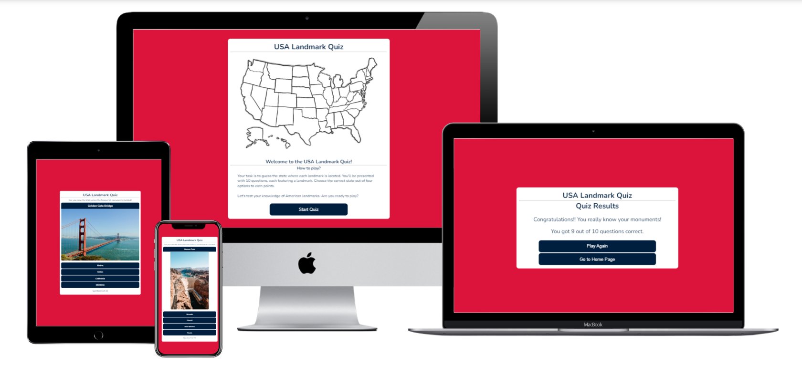

# USA Landmarks Quiz

The main goal of the USA Landmarks Quiz is to provide an engaging and educational experience for users by testing their knowledge of famous landmarks in the United States. The quiz aims to be interactive, visually appealing, and accessible to a wide audience.

Please find a link to the deployed site [here](https://rdawson96.github.io/usa-landmark-quiz/)

## Table of Contents
  - [User Experience](#user-experience)
    - [Project Goals](#project-goals)
    - [User Stories](#user-stories)
    - [Colours Used](#colours-used)
    - [Fonts used](#fonts-used)
    - [Wireframes](#wireframes)
  - [Features](#features)
    - [General Features](#general-features)
  - [Frameworks and Programs Used](#frameworks-and-programs-used)
    - [Languages used](#languages-used)
  - [Testing](#testing)
    - [Validator Testing](#validator-testing)
      - [Validation Errors](#validation-errors)
    - [Accessibility](#accessibility)
      - [1. Lighthouse testing](#1-lighthouse-testing)
      - [2. Semantic HTML](#2-semantic-html)
      - [3. ARIA (Accessible Rich Internet Applications)](#3-aria-accessible-rich-internet-applications)
      - [4. Contrast and Readability](#4-contrast-and-readability)
      - [5. Alt Text for Images](#5-alt-text-for-images)
      - [6. Responsive Design](#6-responsive-design)
    - [Manual testing](#manual-testing)
      - [Common Elements](#common-elements)
      - [Browser Compatibility](#browser-compatibility)
  - [Finished Product](#finished-product)
  - [Deployment](#deployment)
    - [Github](#github)
  - [Bugs](#bugs)
  - [Credits](#credits)
    - [Content](#content)
    - [Media](#media)
    - [Code](#code)

## User Experience

### Project Goals
- Provide an engaging and educational experience for users
- Test users' knowledge of famous landmarks in the United States
- Create an interactive and visually appealing quiz
- Ensure accessibility to a wide audience

### User Stories
- As a user, I want to test my knowledge of USA landmarks.
- As a user, I want the quiz to be easy to navigate and understand.
- As a user, I want feedback on my answers.
- As a user, I want the quiz to be visually appealing with high-quality images.

### Colours Used
The color scheme of the USA Landmarks Quiz is inspired by the colors of the American flag:

### Fonts used
The primary font used in the quiz is Nunito, sourced from Google Fonts.

### Wireframes
Balsamiq has been used to show the appearance of the site on different devices

|Page | Desktop Version | Mobile Version |
| --- | --- | --- |
| Home page |  |  |
| Game page |  |  |
| Results page |  |  |

## Features

Features of the site

### General Features

## Frameworks and Programs Used

- [Codeanywhere](https://app.codeanywhere.com/)
  - Codeanywhere was used for writing code, committing, and then pushing to GitHub. [GitHub](https://githubcom/)

- [Balsamiq](https://balsamiq.com/)
  - Balsamiq was used to create the wireframes during the design phase of the project.

- [Google Fonts](https://fonts.google.com/)
  - Google Fonts was used to import the font Nunito Italic into the style.css file. Theis font were used throughout the site.

- [Multi Device Website Mockup Generator](https://techsini.com/multi-mockup/index.php)
  - Responsive Design Checker was used in the testing process to check responsiveness on various devices and to generate mockup image.

- [Chrome DevTools](https://developer.chrome.com/docs/devtools/)
  - Chrome DevTools was used during development process for code review and to test responsiveness.

- [Coolers Contrast Checker](https://coolors.co/contrast-checker/112a46-acc8e5)
  - Coolers Contrast Checker was used to make sure the colors I used contrasted well enough for all users

### Languages Used

* [HTML5](https://en.wikipedia.org/wiki/HTML5)
* [CSS3](https://en.wikipedia.org/wiki/CSS)
* [Javascript](https://en.wikipedia.org/wiki/JavaScript)

## Testing

### Validator Testing

- The [W3C Markup Validator](https://validator.w3.org/), [W3C CSS Validator](https://jigsaw.w3.org/css-validator/) and [JSHint](https://jshint.com/) services were used to validate all pages of the project in order to ensure there were no syntax errors.

#### Validation Errors
- CSS
  - The validator found one error with my CSS where I had a stray semicolon.

### Accessibility

#### 1. Lighthouse testing

Light house in Chrome Dev tools was used to confirm accessibility of the site and confirm that the colors of the site are easy to read.

#### 2. Semantic HTML

All images on the website include descriptive alternative text (alt text). This helps users with visual impairments understand the content and context of images even if they cannot see them.

#### 3. ARIA (Accessible Rich Internet Applications)

ARIA attributes were utilised on links to enhance the accessibility of the site allowing for screen readers to accurately pick up information.

#### 4. Contrast and Readability

[Coolers Contrast Checker](https://coolors.co/contrast-checker/112a46-acc8e5) was used to ensure  sufficient contrast in colors chosen to make the content readable for users with visual impairments.

#### 5. Alt Text for Images

All images on the website include descriptive alternative text (alt text). This helps users with visual impairments understand the content and context of images even if they cannot see them.

#### 6. Responsive Design

The website is responsive, providing a seamless experience across various devices and screen sizes. This benefits users with different abilities and ensures a consistent and accessible user experience.

This was tested via [Chrome DevTools](https://developer.chrome.com/docs/devtools/) as the project progressed.

### Manual testing

- Home page

| Feature | Test case | Outcome |
| --- | --- | --- |

- Game page

| Feature | Test case | Outcome |
| --- | --- | --- |

- Results page

| Feature | Test case | Outcome |
| --- | --- | --- |

#### Common Elements

#### Browser Compatibility

## Finished Product

| Page | Desktop | Mobile |
| --- | --- | --- |
| Home page |  |  |
| Quiz page |  |  |
| Results page |  |  |

## Deployment

### Github

- The following steps are to deploy the website to Github Pages from the GitHub repository:
  -  Log in to GitHub and locate the [GitHub Repository](https://github.com/).
  -  At the top of the Repository, Go to the Settings button on the menu.
  -  Scroll down the Settings page until you locate the Pages section.
  -  Under Source, click the dropdown called None and select Master Branch.
  -  The page will refresh automatically and generate a link to your website.

## Bugs
| Bug | How it was fixed |
| Event listeners not being disabled correctly | --- |
| Next question not loading after a delay | --- |
| Question number tallying up when the quiz was restarted | --- |

## Credits

### Media
All images featured on this site are sourced from royalty-free libraries.

- Quiz Images
  - [pxhere](https://pxhere.com/)
    - Mount Rushmore image by pxhere
    - Statue of Liberty image by pxhere
    - Cloud Gate image by pxhere
    - Grand Canyon image by pxhere
    - Crazy Horse image by pxhere
  - [pexels](https://www.pexels.com/)
    - Monument Valley image by Pixabay
    - The Space Needle image by Sergei A
    - Lincoln Memorial image by Pixabay
    - Golden Gate Bridge image by Pixabay
  - [unspalsh](https://unsplash.com/)
    - Hoover Dam image by Emily-Jo Sutcliffe
- Home Page image
  - [Freepik](https://www.freepik.com/)
    - Image of USA by rocketpixel

### Code
https://gamedevacademy.org/javascript-docstrings-tutorial/ - docstrings
https://www.freecodecamp.org/news/innerhtml-vs-innertext-vs-textcontent/

[back to the top](#usa-landmarks-quiz)